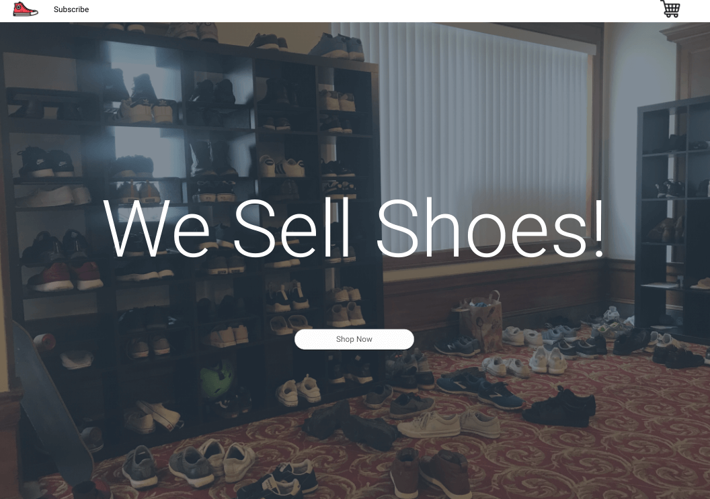
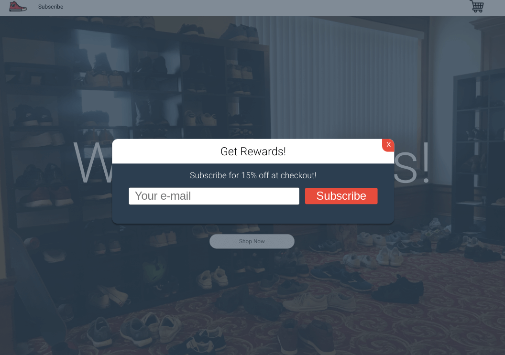

<h1 align="center">We Sell Shoes Tutorial</h1>

   Tutorial from  <a href="https://makeschool.org/mediabook/oa/tutorials/we-sell-shoes/Making-A-Plan-z7M=/" target="_blank">makeschool.org</a>.

## Table of Contents

- [Overview](#overview)
  - [Built With](#built-with)
- [Features](#features)
- [Improvements](#improvements)

## Overview

MakeSchool was a coding bootcamp that went under.  Most content was made free and I found this and decided to follow along.

[Live Link](https://jdegand.github.io/we-sell-shoes)

### Built With

- HTML
- CSS
- JS

## Features

Simple landing page with a popup and faq section. 

Outdated but features a faq implementation variation I had never done.

## Improvements

- Semantic HTML
- Responsive Design
- Styling
- Accessibility
- Convert to a framework that I never used before